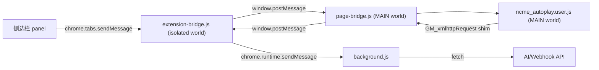

# 架构说明

## 目标

将原有单文件 userscript 改造成浏览器扩展，同时保留页面运行时能力：

- 页面 MAIN world：继续挂钩 NCME 页面内的 `fetch`、`XMLHttpRequest`、Vue 实例与 DOM。
- 扩展 isolated world：负责安全地连接页面脚本、侧边栏和后台 service worker。
- 后台 service worker：代理 AI/Webhook 跨域请求，替代 userscript 的 `GM_xmlhttpRequest` 能力。
- 侧边栏：提供配置、状态查看和手动调试入口。

## 运行链路

## 文件职责

- `extension/src/legacy/ncme_autoplay.user.js`
  - 原自动播放、课程列表、考试识别、题库/AI 作答逻辑。
  - 运行在 MAIN world，能访问页面真实运行时。

- `extension/src/content/page-bridge.js`
  - 在 MAIN world 暴露 `GM_xmlhttpRequest` 兼容函数。
  - 响应侧边栏命令：读取状态、保存 AI 配置、暂停/恢复自动化、调用调试方法。

- `extension/src/content/extension-bridge.js`
  - 在 isolated world 接收侧边栏命令。
  - 转发页面请求到后台代理。

- `extension/src/background.js`
  - 处理 `NCME_PROXY_REQUEST`。
  - 使用扩展权限完成跨域请求。

- `extension/panel/*`
  - 侧边栏 UI。
  - 保存 AI 配置到页面 localStorage。
  - 提供主循环、考试处理、AI 作答、自动提交等手动动作。

## 与参考项目的对应关系

参考 `ai-answer-assistant` 的三点设计：

1. AI 请求放到 background，避免页面 CORS 限制。
2. 配置与控制放到扩展面板，而不是散落在脚本常量里。
3. 页面扫描/作答逻辑保留在 content/page runtime，便于直接操作 DOM 和前端框架状态。

本项目没有直接复用通用问卷模板系统，而是保留 NCME 定制化 runtime 探测与考试模型写入逻辑。
